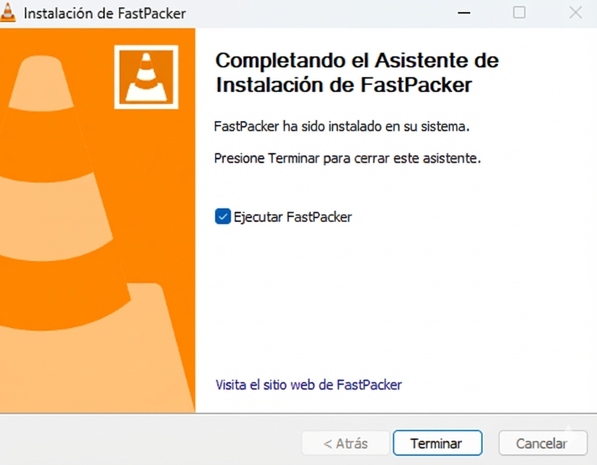

# 📄 DOCUMENTO 1: Manual de Instalación — FastPacker

## 1. Introducción
Gracias por elegir **FastPacker**. Este manual te guiará durante todo el proceso para instalar nuestra herramienta de compresión en tu equipo Windows de forma segura y rápida.

**SE HA UTILIZADO NANO BANANA PARA CAMBIAR EL NOMBRE EN LAS IMAGENES DE INSTALACION DE VLC PARA SIMULAR LA INSTALACION DE UN PROGRAMA INVENTADO.**

## 💻 2. Requisitos mínimos del sistema
Antes de empezar, asegúrate de que tu equipo cumple con lo siguiente:
* **Sistema Operativo:** Windows 10 o Windows 11.
* **Espacio en disco:** Al menos 60 MB libres.
* **Memoria RAM:** Mínimo 2 GB recomendados.

## 3. Descarga del instalador
1. Entra al portal de descargas de la intranet de la empresa.
2. Busca la sección de **"Herramientas"** y pulsa el botón **"Descargar FastPacker (v.2.0)"**.
3. Guarda el instalador en tu carpeta de *Descargas* o en el *Escritorio*.

## 4. Proceso de instalación
Sigue estos pasos una vez tengas el archivo descargado:

1. **Ejecutar:** Haz doble clic sobre el archivo `FastPacker_Setup.exe`.
2. **Bienvenida:** Se abrirá el asistente. Pulsa el botón **"Siguiente"** para comenzar.

   

3. **Licencia:** Lee brevemente y marca la casilla *"Acepto los términos de licencia"*. Pulsa **"Siguiente"**.
4. **Ubicación:** El sistema te propondrá instalarlo en `C:\Archivos de Programa\FastPacker`. Te recomendamos no cambiarlo. Pulsa **"Siguiente"**.
5. **Instalar:** Pulsa el botón central **"Instalar"** y espera a que la barra verde se complete.

   

## 5. Verificación final
* Al terminar la carga, verás una pantalla de *"Instalación Completada"*.
* Marca la casilla **"Iniciar FastPacker ahora"** y pulsa **Terminar**.

